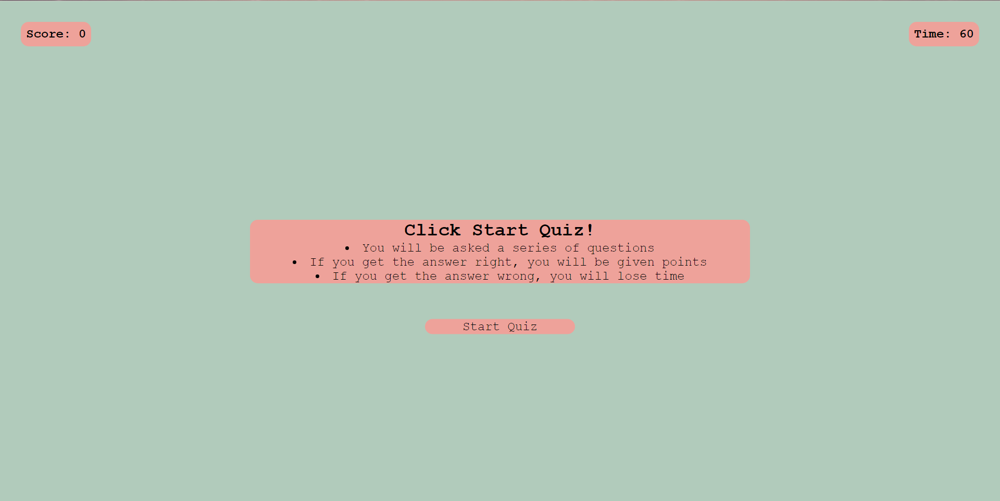
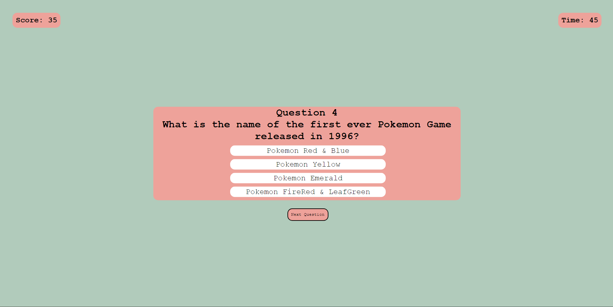

# Pokemon Quiz

## Description

This project is designed to create a working web quiz that offers a variety of questions with a series of answer options. If you get an answer correct, it will add points together and if you get one wrong, it will turn red and detract time from the global timer. The goal is to get all of them correct of course but you are then prompted to enter in your initials with the points you earned.

## Insallation

N/A

## Usage

This page will serve any and all users who want to test their knowledge!

Below you will find a screenshot to this website.

)

[Next will be the link you can reach the webpage at!](https://volexity21.github.io/Pokemon-Quiz/)

## Credits

These questions were created and implimented by myself using knowledge from the Bootcamp and a variety of research sites such as W3Schools, Stack overflow, and MDN Webdocs.